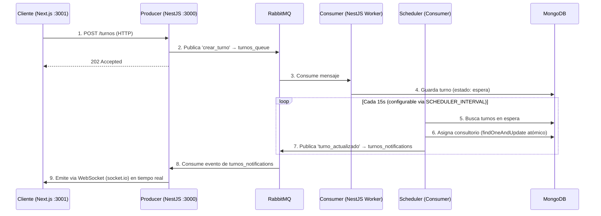

# IA_P1 - Sistema de Turnos Médicos en Tiempo Real

> Sistema de gestión de turnos médicos basado en **Microservicios**, **Event-Driven Architecture** y **WebSockets en tiempo real**.

## Arquitectura y Flujo

El sistema desacopla la recepción de turnos de su procesamiento, garantizando alta disponibilidad, escalabilidad y actualizaciones en tiempo real.



## Stack Tecnológico

| Capa | Tecnología | Versión mínima |
|---|---|---|
| Backend (microservicios) | **NestJS** | v10 |
| Frontend | **Next.js** (App Router) | v14 |
| Base de datos | **MongoDB** | v7 |
| Message broker | **RabbitMQ** | v3 |
| WebSockets | **socket.io** (`@nestjs/websockets`) | — |
| Contenedores | **Docker + Docker Compose** | — |
| Estilos frontend | **CSS Modules** | — |

## Servicios

| Servicio | Tecnología | Puerto | Responsabilidad |
|---|---|---|---|
| **Producer** | NestJS | `3000` | API Gateway, validación de entrada, WebSocket Gateway, Swagger docs |
| **Consumer** | NestJS | — | Procesamiento asíncrono, Scheduler de asignación, persistencia en MongoDB |
| **Frontend** | Next.js 16 | `3001` | UI reactiva, cliente WebSocket, registro de turnos, dashboard de atendidos |
| **RabbitMQ** | RabbitMQ 3 | `5672` / `15672` | Broker de mensajería (`turnos_queue`, `turnos_notifications`) |
| **MongoDB** | MongoDB 7 | `27017` | Base de datos NoSQL persistente |

## Colas RabbitMQ

| Cola | Dirección | Contenido | Consumidor |
|---|---|---|---|
| `turnos_queue` | Producer → Consumer | `crear_turno` (payload del turno) | Consumer Worker |
| `turnos_notifications` | Consumer → Producer | `turno_actualizado` (turno con consultorio) | Producer → WS Gateway |

## Instalación y Ejecución

### Prerrequisitos
- Docker Engine & Docker Compose

### Pasos

1. **Clonar el repositorio**
   ```bash
   git clone https://github.com/Duver0/IA_P1.git
   cd IA_P1
   ```

2. **Configurar entorno**
   ```bash
   cp .env.example .env
   ```

3. **Iniciar la infraestructura**
   ```bash
   docker compose up -d --build
   ```

4. **Acceder a la aplicación**
   - **Frontend:** [http://localhost:3001](http://localhost:3001)
   - **API Swagger:** [http://localhost:3000/api/docs](http://localhost:3000/api/docs)
   - **RabbitMQ Admin:** [http://localhost:15672](http://localhost:15672) (user: `guest`, pass: `guest`)

## Variables de Entorno

Todas las credenciales y configuraciones se manejan via `.env`. **Nunca commitear `.env` a Git.**

```env
# Producer
PRODUCER_PORT=3000

# Frontend
FRONTEND_PORT=3001
NEXT_PUBLIC_API_BASE_URL=http://localhost:3000
NEXT_PUBLIC_WS_URL=http://localhost:3000

# RabbitMQ
RABBITMQ_PORT=5672
RABBITMQ_MGMT_PORT=15672
RABBITMQ_USER=guest
RABBITMQ_PASS=guest
RABBITMQ_QUEUE=turnos_queue

# MongoDB
MONGODB_PORT=27017
MONGO_USER=admin
MONGO_PASS=admin123
```

## API Endpoints (Producer)

| Método | Endpoint | Descripción | Respuesta |
|---|---|---|---|
| `POST` | `/turnos` | Crear un nuevo turno (async) | `202 Accepted` |
| `GET` | `/turnos` | Listar todos los turnos | `200 OK` |
| `GET` | `/turnos/:cedula` | Buscar turnos por cédula | `200 OK` |

### Ejemplo cURL

```bash
curl -X POST http://localhost:3000/turnos \
  -H "Content-Type: application/json" \
  -d '{"nombre": "Paciente Test", "cedula": 12345, "priority": "alta"}'
```

```json
{
  "status": "accepted",
  "message": "Turno en proceso de asignación"
}
```

## Estructura del Proyecto

```
IA_P1/
├── backend/
│   ├── producer/                  # API Gateway + WebSocket Server (puerto 3000)
│   │   └── src/
│   │       ├── turnos/            # Controladores HTTP, DTOs, lógica de negocio
│   │       ├── events/            # RabbitMQ → WebSocket event handlers
│   │       ├── dto/               # Data Transfer Objects
│   │       ├── schemas/           # Mongoose schemas
│   │       └── types/             # Tipos compartidos (TurnoEventPayload)
│   └── consumer/                  # Worker Service (sin puerto expuesto)
│       └── src/
│           ├── turnos/            # Persistencia MongoDB
│           ├── scheduler/         # Lógica de asignación automática (cron)
│           ├── notifications/     # Publicación de eventos post-asignación
│           ├── dto/               # Data Transfer Objects
│           ├── schemas/           # Mongoose schemas
│           └── types/             # Tipos compartidos
├── frontend/                      # Next.js App Router (puerto 3001)
│   └── src/
│       ├── app/                   # Pages y routes (App Router)
│       ├── components/            # Componentes UI reutilizables
│       │   ├── AppointmentCard/
│       │   ├── AppointmentList/
│       │   └── AppointmentRegistrationForm/
│       ├── hooks/                 # Custom hooks (WebSocket, audio, registro)
│       ├── domain/                # Interfaces puras (Appointment, DTOs)
│       ├── repositories/          # Repository pattern (puerto + adaptador HTTP)
│       ├── lib/                   # httpClient + CircuitBreaker
│       ├── services/              # AudioService (singleton)
│       ├── config/                # Variables de entorno con validación
│       ├── security/              # Sanitización de inputs
│       ├── utils/                 # date-formatter, error-guard (type guards)
│       ├── styles/                # CSS Modules (page, form, globals)
│       └── __tests__/             # Tests automatizados (Jest + Testing Library)
├── docker-compose.yml             # Orquestación de contenedores
├── .env.example                   # Variables de entorno documentadas
└── AI_WORKFLOW.md                 # Guía de arquitectura y principios SOLID
```

## Testing

### Backend — Producer

```bash
cd backend/producer
npm test               # Ejecutar tests unitarios
npm run test:watch     # Modo watch
npm run test:cov       # Con cobertura
```

Tests de DTOs, controladores y servicios del Producer.

### Frontend

```bash
cd frontend
npm test               # Ejecutar 84 tests (11 suites)
npm run test:watch     # Modo watch
npm run test:coverage  # Con cobertura
```

| Tipo | Descripción | Suites |
|------|-------------|--------|
| **Unitarios (lógica pura)** | Type guards, formateo, sanitización, circuit breaker | 5 |
| **Unitarios (componentes)** | Renderizado y comportamiento con Testing Library | 3 |
| **Integración (repositorios)** | Adapter HTTP contra la interface (puerto) con mocks | 1 |
| **Configuración** | Validación de variables de entorno al arranque | 1 |
| **Servicios** | Ciclo de vida del AudioService (singleton, unlock, autoplay) | 1 |

## Características Clave

- **Event-Driven**: Comunicación asíncrona entre servicios via RabbitMQ
- **Real-Time**: Actualizaciones instantáneas en el frontend via WebSocket (`socket.io`)
- **Concurrency Safe**: Asignación de turnos atómica (`findOneAndUpdate`) sin race conditions
- **Resiliente**: Circuit Breaker, retry con backoff, timeout configurable en el frontend
- **Type-Safe**: Interfaces compartidas (`TurnoEventPayload`), zero `any` en TypeScript
- **Validación**: DTOs con `class-validator`, `ValidationPipe` global con `whitelist` y `transform`
- **Ack/Nack explícitos**: Diferenciación entre errores de validación (no requeue) y transitorios (requeue)
- **Seguridad**: Sanitización de inputs, rate limiting, CSP headers, CORS configurado
- **Infraestructura como Código**: Entorno completamente dockerizado
- **Arquitectura Hexagonal** (en progreso): Puertos e interfaces en `domain/`, adaptadores en `repositories/`

## Auditoría y Deuda Técnica

| Documento | Contenido |
|---|---|
| `AI_WORKFLOW.md` | Guía de arquitectura, principios SOLID, reglas de generación de código |
| `DEBT_REPORT.md` | Auditoría de deuda técnica del backend |
| `DEBT_REPORT_FRONTEND.md` | Auditoría de deuda técnica del frontend (18/18 resueltas) |
| `AUDIT_REPORT.md` | Reporte general de auditoría |

## Roadmap

- [x] **Week 0**: Infraestructura base, Producer, Consumer, Frontend, Docker Compose
- [x] **Week 1**: Refactor hacia arquitectura hexagonal, tests automatizados, deuda técnica resuelta
- [ ] **Week 2**: Adapters completos, Use Cases en backend
- [ ] **Week 3–6**: DLQ, observabilidad, hardening para producción
