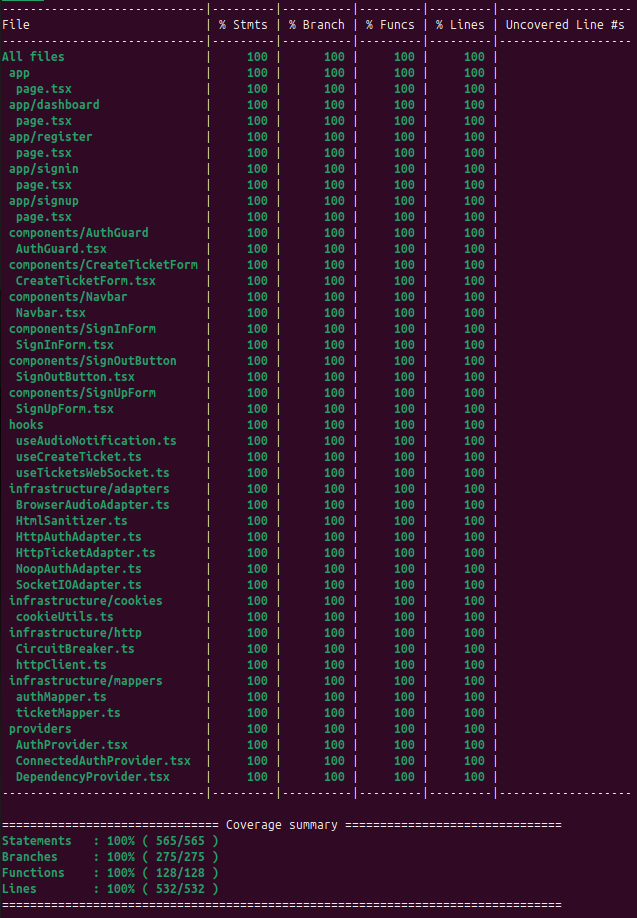

# TESTING_STRATEGY.md

Este documento resume la estrategia de QA y los ajustes de testing realizados hasta ahora.
Prioridad: verificar primero (correcto tecnico), validar despues (reglas de negocio).

---

## 1) Verificar vs validar (definicion breve)

- Verificar: pruebas unitarias que confirman contratos tecnicos y flujos esperados.
- Validar: pruebas que protegen reglas criticas de negocio y escenarios reales de uso.

---

## 2) Cambios actuales en testing (estado verificado)

Se revisaron y corrigieron las pruebas existentes en:
- Consumer
- Producer

Objetivo alcanzado: solo pruebas unitarias, minimas y con comentarios claros por capa.

---

## 3) Hallazgo de negocio (validacion pendiente)

Se identifico que el funcionamiento actual no cubre la necesidad del cliente:
- Falta una separacion publica vs privada.
- Se requiere login para que el historial sea privado para la empresa.

Esta necesidad define la siguiente etapa de validacion de negocio.

---

## 4) Proximos pasos (no ejecutados en este momento)

El siguiente paso sera iniciar TDD para la feature de login:
- Empezar en RED con casos que validen privacidad del historial.
- Luego GREEN y refactor.

No se implementa en esta version.

---

## 5) Nota de alcance de esta version

Esta version solo organiza y limpia la base de pruebas unitarias.
No agrega nuevas reglas de negocio ni cambia el flujo actual.

---

## 6) Frontend — Estrategia de testing (Next.js + React)

### Stack y herramientas

| Herramienta | Rol |
|---|---|
| Jest 30 | Runner y cobertura |
| React Testing Library | Renderizado y queries de DOM |
| TypeScript strict | Typecheck en CI (`tsc --noEmit`) |
| jest-environment-jsdom | Entorno DOM simulado |

### Principios aplicados

- **TDD RED → GREEN → REFACTOR** en todas las features nuevas.
- Pruebas unitarias por capa, sin dependencias reales (todo mockeado en la frontera de cada capa).
- Cada suite prueba un solo artefacto: componente, hook, adaptador o proveedor.
- Los mocks se centralizan en `src/__tests__/mocks/factories.ts` para reutilización y consistencia.
- Sin pruebas de snapshot; solo aserciones de comportamiento y contrato.

### Feature de autenticación (HU implementada con TDD)

Se implementó la capa de autenticación completa siguiendo TDD estricto:

**Componentes nuevos:**
- `SignInForm` — formulario email/password con validación y manejo de error
- `SignUpForm` — registro con rol `employee` hardcodeado (alcance de la HU)
- `SignOutButton` — dispara `signOut` del contexto de auth
- `AuthGuard` — HOC que redirige a `/signin` si no autenticado o sin el rol requerido

**Providers nuevos:**
- `AuthProvider` — contexto React con estado `{ user, loading, error, isAuthenticated, hasRole, signIn, signUp, signOut }`
- `ConnectedAuthProvider` — conecta `AuthProvider` con el adaptador HTTP real (`HttpAuthAdapter`)

**Adaptadores nuevos:**
- `HttpAuthAdapter` — llama al backend REST para `signIn`, `signUp`, `signOut`, `getSession`
- `NoopAuthAdapter` — implementación nula del puerto `AuthService` para testing y contextos sin auth

**Infraestructura:**
- `authMapper.ts` — transforma respuesta HTTP ↔ dominio (`AuthResponse → User`)
- `cookieUtils.ts` — lee/escribe token JWT en cookies HttpOnly (SSR-safe)

**Páginas nuevas:** `/signin`, `/signup`

### Decisiones de diseño relevantes

- `mockUseDeps.mockReturnValue` en cada suite recibe un objeto completo que satisface la interfaz `Dependencies`, incluyendo `authService`. Esto garantiza que `tsc --noEmit` no falle en CI aunque Jest no haga typecheck.
- El rol en el registro (`SignUpForm`) fue hardcodeado a `"employee"` por alcance de la HU; el selector de rol fue eliminado del formulario.
- `/signup` es ruta pública en esta iteración; en HUs futuras se podría restringir a admins.
- `NoopAuthAdapter` permite que páginas o tests que no necesitan auth compilen y corran sin proporcionar una implementación real.

---

### Reglas de negocio validadas en el frontend (`[Validar]`)

Estas reglas de negocio tienen cobertura de tests etiquetados con `[Validar]` en las suites correspondientes:

#### Acceso restringido
- `[Validar]` Un usuario que no ha iniciado sesión no puede ver páginas privadas y es enviado al login.
- `[Validar]` Un usuario autenticado sin el permiso adecuado no puede acceder a secciones restringidas y es enviado al inicio.
- `[Validar]` El panel principal no muestra su contenido si no hay una sesión activa.

#### Contraseña segura (registro)
- `[Validar]` El sistema no permite registrarse con una contraseña que no tenga al menos una letra mayúscula.
- `[Validar]` El sistema no permite registrarse con una contraseña que no tenga al menos una letra minúscula.
- `[Validar]` El sistema no permite registrarse con una contraseña que no tenga al menos un número.
- `[Validar]` El sistema no permite registrarse con una contraseña que no tenga al menos un carácter especial.
- `[Validar]` El sistema no permite registrarse con una contraseña de menos de 8 caracteres.
- `[Validar]` El sistema permite continuar el registro cuando la contraseña cumple todos los requisitos de seguridad.

#### Correo duplicado (registro)
- `[Validar]` Si el correo ingresado ya pertenece a una cuenta existente, el usuario no es redirigido y permanece en el formulario.
- `[Validar]` El sistema muestra al usuario un mensaje claro indicando que el correo ya está registrado.
- `[Validar]` El mensaje de error se presenta en español sin importar el idioma en que lo reporte el servidor.

#### Turno duplicado (registro de turno)
- `[Validar]` No se puede generar un nuevo turno para una cédula que ya tiene un turno en espera de ser atendido.
- `[Validar]` No se puede generar un nuevo turno para una cédula que ya está siendo llamada en ese momento.
- `[Validar]` Sí se puede generar un nuevo turno para una cédula cuyo turno anterior ya fue atendido.

#### Confirmación visual tras registro exitoso
- `[Validar]` Al crear una cuenta con éxito, el sistema guarda un mensaje de confirmación para mostrarlo en la siguiente pantalla.
- `[Validar]` Al ingresar a la pantalla de login después de registrarse, el usuario ve un mensaje de bienvenida que confirma que su cuenta fue creada.
- `[Validar]` El mensaje de confirmación desaparece una vez que el usuario lo ha visto y no vuelve a aparecer si recarga la página.
- `[Validar]` El mensaje de confirmación se oculta automáticamente a los 4 segundos sin que el usuario tenga que cerrarlo.

