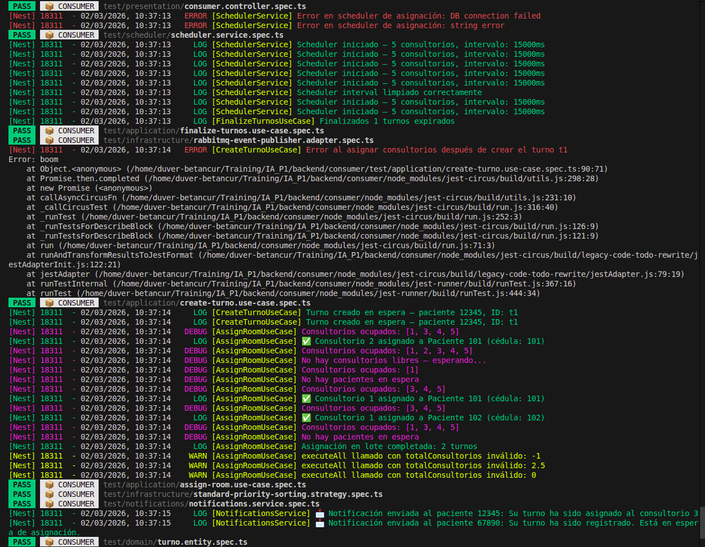
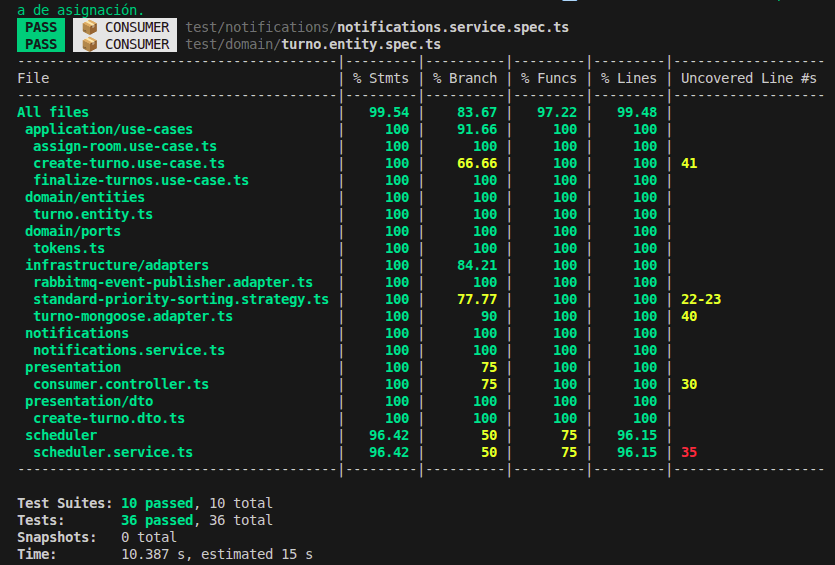

# 📊 Coverage Report - Consumer Service

> **Última actualización**: Marzo 2026  
> **Display Name**: 📦 CONSUMER

---

## Métricas de Cobertura

| Métrica     | Valor   | Estado |
|-------------|---------|--------|
| Statements  | 99.54%  | ✅     |
| Branches    | 83.67%  | ✅     |
| Functions   | 97.22%  | ✅     |
| Lines       | 99.48%  | ✅     |

---

## Resumen de Ejecución

| Dato              | Valor      |
|-------------------|------------|
| Test Suites       | 10 passed  |
| Tests             | 36 passed  |
| Snapshots         | 0          |
| Tiempo estimado   | ~8s        |

---

## Evidencias

### Ejecución de Tests


### Reporte de Cobertura


---

## Comando para Generar

```bash
npm run test:cov -- --runInBand --forceExit
```

---

## Archivos Excluidos del Coverage

Configurados en `jest.config.js`:

```javascript
coveragePathIgnorePatterns: [
  'main.ts',
  '.module.ts',
  '.schema.ts',
]
```
