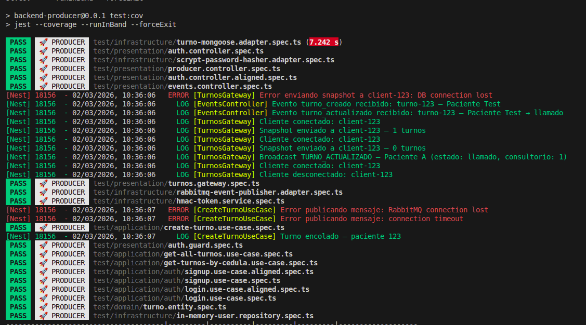
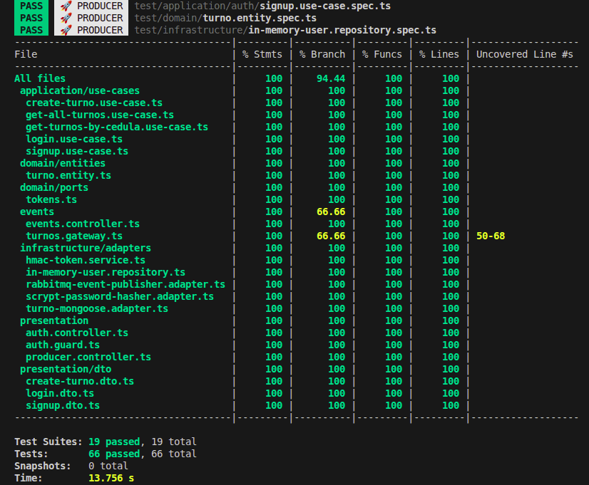

# 📊 Coverage Report - Producer Service

> **Última actualización**: Marzo 2026  
> **Display Name**: 🚀 PRODUCER

---

## Métricas de Cobertura

| Métrica     | Valor   | Estado |
|-------------|---------|--------|
| Statements  | 100%    | ✅     |
| Branches    | 94.44%  | ✅     |
| Functions   | 100%    | ✅     |
| Lines       | 100%    | ✅     |

---

## Resumen de Ejecución

| Dato              | Valor      |
|-------------------|------------|
| Test Suites       | 19 passed  |
| Tests             | 66 passed  |
| Snapshots         | 0          |
| Tiempo estimado   | ~12s       |

---

## Evidencias

### Ejecución de Tests


### Reporte de Cobertura


---

## Comando para Generar

```bash
npm run test:cov -- --runInBand --forceExit
```

---

## Archivos Excluidos del Coverage

Configurados en `jest.config.js`:

```javascript
coveragePathIgnorePatterns: [
  'main.ts',
  '.module.ts',
  '.schema.ts',
]
```
